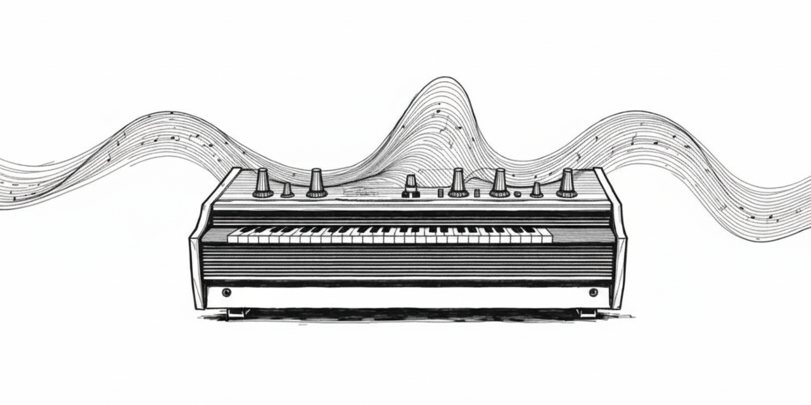

# faust-synth-test 🎛️

A simple VST3 synthesizer built with [Faust DSP](https://faust.grame.fr/) and [JUCE](https://juce.com/), tested in FL Studio.

This is a learning project exploring how to integrate Faust-generated DSP code into a JUCE audio plugin.

---

## 🔊 Sound engine

The DSP is written in Faust (`test2.dsp`) and compiled to C++ (`FaustDSP.h`).

- **Oscillator** — sawtooth wave
- **Filter** — lowpass from `webaudio.lib` (`wa.lowpass2`) with cutoff, resonance and detune
- **Envelope** — AR (attack/release) triggered by MIDI gate
- **Polyphony** — 8 voices

---

## 🎛️ Parameters

| Parameter | Range | Description |
|---|---|---|
| Cutoff Hz | 20 – 20000 Hz | Filter cutoff frequency |
| Resonance | 0.1 – 20 | Filter Q / resonance |
| Detune cents | -1200 – 1200 | Filter detune in cents |

---

## 🛠️ Building from source

### Requirements

- [Faust](https://faust.grame.fr/downloads/) (with `webaudio.lib`)
- [JUCE 8](https://juce.com/get-juce/) + Projucer
- Visual Studio 2022 or 2026 with **Desktop C++** workload
- Windows 10/11 x64

### Steps

**1. Generate DSP header**
```bash
faust -lang cpp -cn FaustDSP -o Source/FaustDSP.h Source/test2.dsp
```

**2. Open project in Projucer**

Open `FaustSynth.jucer` in Projucer and click **Save and Open in IDE**.

**3. Add Faust include path**

In Visual Studio → project properties → C/C++ → Additional Include Directories, add:
```
C:\Program Files\Faust\include
```
Do this for both `FaustSynth_SharedCode` and `FaustSynth_VST3`.

**4. Build**

Set configuration to **Release | x64** and press `Ctrl+Shift+B`.

**5. Install**

Copy the plugin to your VST3 folder:
```bash
cp -r Builds/VisualStudio2026/x64/Release/VST3/FaustSynth.vst3 "C:/Program Files/Common Files/VST3/"
```

**6. Scan in FL Studio**

Options → Manage Plugins → Start scan.

---

## 📁 Project structure

```
Source/
├── test2.dsp           # Faust DSP source
├── FaustDSP.h          # Generated from test2.dsp (run faust command above)
├── PluginProcessor.h/cpp
└── PluginEditor.h/cpp
FaustSynth.jucer        # Projucer project file
```

---

## 📝 Notes

- `FaustDSP.h` is generated — if missing, run the faust command in step 1
- Tested on Windows 10 with FL Studio 12
- This is a test/learning project, not production-ready



---

*Built using Faust + JUCE*
